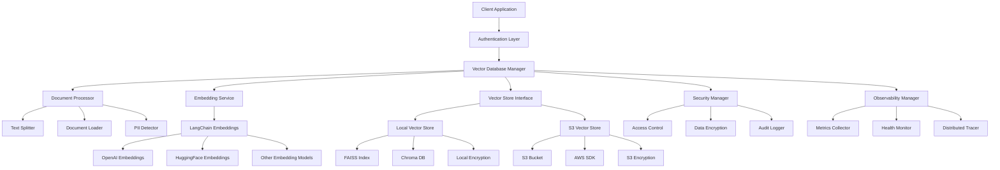

# Design Document

## Overview

The LangChain Vector Database system will be implemented as a modular Python application that provides a unified interface for document ingestion, vector storage, and semantic search operations. The system will support multiple storage backends including local file systems and AWS S3, with pluggable embedding models through LangChain's ecosystem.

The architecture follows a layered approach with clear separation between the embedding generation, vector storage, and query processing components. This design enables easy extension to support additional vector stores and embedding models in the future.

## Architecture



## Components and Interfaces

### VectorDatabaseManager
The main orchestrator class that coordinates all operations.

**Interface:**
```python
class VectorDatabaseManager:
    def __init__(self, config: VectorDBConfig)
    def add_documents(self, documents: List[Document]) -> List[str]
    def add_texts(self, texts: List[str], metadatas: List[dict] = None) -> List[str]
    def similarity_search(self, query: str, k: int = 4) -> List[Document]
    def similarity_search_with_score(self, query: str, k: int = 4) -> List[Tuple[Document, float]]
    def update_document(self, doc_id: str, document: Document) -> bool
    def delete_documents(self, doc_ids: List[str]) -> bool
    def get_document_metadata(self, doc_id: str) -> dict
    def persist(self) -> bool
    def load(self) -> bool
```

### DocumentProcessor
Handles document loading, text splitting, and preprocessing.

**Interface:**
```python
class DocumentProcessor:
    def __init__(self, chunk_size: int = 1000, chunk_overlap: int = 200)
    def process_documents(self, file_paths: List[str]) -> List[Document]
    def process_texts(self, texts: List[str], metadatas: List[dict] = None) -> List[Document]
    def split_text(self, text: str) -> List[str]
```

### EmbeddingService
Abstracts embedding model operations using LangChain.

**Interface:**
```python
class EmbeddingService:
    def __init__(self, embedding_model: str, model_kwargs: dict = None)
    def embed_documents(self, texts: List[str]) -> List[List[float]]
    def embed_query(self, text: str) -> List[float]
    def get_embedding_dimension(self) -> int
```

### VectorStoreInterface
Abstract base class for different vector storage backends.

**Interface:**
```python
class VectorStoreInterface(ABC):
    @abstractmethod
    def add_vectors(self, vectors: List[List[float]], documents: List[Document]) -> List[str]
    @abstractmethod
    def search_vectors(self, query_vector: List[float], k: int) -> List[Tuple[Document, float]]
    @abstractmethod
    def update_vector(self, doc_id: str, vector: List[float], document: Document) -> bool
    @abstractmethod
    def delete_vectors(self, doc_ids: List[str]) -> bool
    @abstractmethod
    def get_document(self, doc_id: str) -> Document
    @abstractmethod
    def persist(self) -> bool
    @abstractmethod
    def load(self) -> bool
```

### LocalVectorStore
Implementation for local file system storage using FAISS or Chroma.

**Key Features:**
- Uses FAISS for efficient similarity search
- Stores metadata in JSON files
- Supports incremental updates
- Automatic persistence to disk

### S3VectorStore
Implementation for AWS S3 storage backend.

**Key Features:**
- Stores vector indices as compressed files in S3
- Uses S3 object metadata for document information
- Implements efficient batching for S3 operations
- Supports versioning and backup strategies

### SecurityManager
Handles authentication, authorization, and data protection.

**Interface:**
```python
class SecurityManager:
    def __init__(self, config: SecurityConfig)
    def authenticate_user(self, credentials: dict) -> AuthToken
    def authorize_operation(self, token: AuthToken, operation: str, resource: str) -> bool
    def encrypt_data(self, data: bytes) -> bytes
    def decrypt_data(self, encrypted_data: bytes) -> bytes
    def detect_pii(self, text: str) -> List[PIIMatch]
    def mask_sensitive_data(self, text: str) -> str
    def audit_log(self, event: AuditEvent) -> None
```

### ObservabilityManager
Provides comprehensive monitoring, logging, and tracing capabilities.

**Interface:**
```python
class ObservabilityManager:
    def __init__(self, config: ObservabilityConfig)
    def log_event(self, level: str, message: str, context: dict = None) -> None
    def record_metric(self, name: str, value: float, tags: dict = None) -> None
    def start_trace(self, operation: str) -> TraceContext
    def end_trace(self, context: TraceContext, status: str = "success") -> None
    def health_check(self) -> HealthStatus
    def get_system_metrics(self) -> SystemMetrics
```

## Data Models

### VectorDBConfig
Configuration class for the vector database system.

```python
@dataclass
class VectorDBConfig:
    storage_type: str  # "local" or "s3"
    embedding_model: str  # "openai", "huggingface", etc.
    storage_path: str  # Local path or S3 bucket name
    
    # Embedding model specific config
    model_kwargs: dict = field(default_factory=dict)
    
    # Storage specific config
    storage_kwargs: dict = field(default_factory=dict)
    
    # Document processing config
    chunk_size: int = 1000
    chunk_overlap: int = 200
    
    # AWS S3 specific config (when storage_type="s3")
    aws_access_key_id: str = None
    aws_secret_access_key: str = None
    aws_region: str = "us-east-1"
    s3_prefix: str = "vectors/"
    
    # Security config
    security: SecurityConfig = None
    
    # Observability config
    observability: ObservabilityConfig = None

@dataclass
class SecurityConfig:
    # Authentication
    auth_enabled: bool = True
    auth_type: str = "api_key"  # "api_key", "jwt", "oauth"
    api_key_header: str = "X-API-Key"
    jwt_secret: str = None
    
    # Authorization
    rbac_enabled: bool = True
    default_role: str = "reader"
    
    # Encryption
    encryption_enabled: bool = True
    encryption_key: str = None
    encryption_algorithm: str = "AES-256-GCM"
    
    # Data protection
    pii_detection_enabled: bool = True
    data_masking_enabled: bool = False
    
    # Security monitoring
    audit_logging_enabled: bool = True
    rate_limiting_enabled: bool = True
    max_requests_per_minute: int = 100

@dataclass
class ObservabilityConfig:
    # Logging
    log_level: str = "INFO"
    log_format: str = "json"
    log_file: str = None
    
    # Metrics
    metrics_enabled: bool = True
    metrics_port: int = 8080
    metrics_endpoint: str = "/metrics"
    
    # Tracing
    tracing_enabled: bool = True
    tracing_service_name: str = "vector-database"
    tracing_endpoint: str = None
    
    # Health checks
    health_check_enabled: bool = True
    health_check_port: int = 8081
    health_check_endpoint: str = "/health"
    
    # Performance monitoring
    performance_monitoring_enabled: bool = True
    memory_threshold_mb: int = 1000
    cpu_threshold_percent: float = 80.0
```

### Document
Extended LangChain Document class with additional metadata.

```python
@dataclass
class Document:
    page_content: str
    metadata: dict = field(default_factory=dict)
    doc_id: str = None
    embedding: List[float] = None
    created_at: datetime = None
    updated_at: datetime = None
    
    # Security metadata
    access_level: str = "public"  # "public", "internal", "confidential"
    owner: str = None
    pii_detected: bool = False
    encrypted: bool = False

@dataclass
class AuthToken:
    user_id: str
    roles: List[str]
    permissions: List[str]
    expires_at: datetime
    correlation_id: str

@dataclass
class AuditEvent:
    timestamp: datetime
    user_id: str
    operation: str
    resource: str
    status: str
    details: dict
    correlation_id: str

@dataclass
class PIIMatch:
    type: str  # "email", "phone", "ssn", etc.
    text: str
    start_pos: int
    end_pos: int
    confidence: float

@dataclass
class HealthStatus:
    status: str  # "healthy", "degraded", "unhealthy"
    components: dict
    timestamp: datetime
    
@dataclass
class SystemMetrics:
    memory_usage_mb: float
    cpu_usage_percent: float
    disk_usage_mb: float
    active_connections: int
    request_count: int
    error_count: int
    avg_response_time_ms: float
```

## Error Handling

### Exception Hierarchy
```python
class VectorDBException(Exception):
    """Base exception for vector database operations"""
    def __init__(self, message: str, correlation_id: str = None):
        super().__init__(message)
        self.correlation_id = correlation_id

class EmbeddingException(VectorDBException):
    """Raised when embedding generation fails"""
    pass

class StorageException(VectorDBException):
    """Raised when storage operations fail"""
    pass

class ConfigurationException(VectorDBException):
    """Raised when configuration is invalid"""
    pass

class S3Exception(StorageException):
    """Raised when S3 operations fail"""
    pass

class SecurityException(VectorDBException):
    """Raised when security operations fail"""
    pass

class AuthenticationException(SecurityException):
    """Raised when authentication fails"""
    pass

class AuthorizationException(SecurityException):
    """Raised when authorization fails"""
    pass

class EncryptionException(SecurityException):
    """Raised when encryption/decryption fails"""
    pass

class ObservabilityException(VectorDBException):
    """Raised when observability operations fail"""
    pass
```

### Error Handling Strategy
- All operations return success/failure status with detailed error messages
- Retry logic with exponential backoff for network operations (S3)
- Graceful degradation when optional features fail
- Comprehensive logging for debugging and monitoring
- Input validation with clear error messages

### S3 Specific Error Handling
- Authentication failures: Clear credential error messages
- Network timeouts: Automatic retry with backoff
- Bucket access issues: Permission-specific error guidance
- Large file handling: Multipart upload with progress tracking

## Testing Strategy

### Unit Testing
- Mock external dependencies (OpenAI API, AWS S3)
- Test each component in isolation
- Comprehensive test coverage for error conditions
- Property-based testing for vector operations

### Integration Testing
- End-to-end workflows with real embedding models
- S3 integration tests with test buckets
- Performance testing with various document sizes
- Concurrent operation testing

### Test Data Strategy
- Sample documents of various formats (PDF, TXT, MD)
- Test embeddings with known similarity relationships
- Mock S3 responses for consistent testing
- Benchmark datasets for performance validation

### Performance Testing
- Vector search latency benchmarks
- Memory usage profiling with large document sets
- S3 operation performance under various network conditions
- Concurrent user simulation testing

### Security Testing
- Authentication and authorization flow testing
- Encryption/decryption performance and correctness
- PII detection accuracy and performance
- Rate limiting and security event logging
- Penetration testing for common vulnerabilities

### Observability Testing
- Metrics collection accuracy and performance impact
- Log generation and structured logging validation
- Distributed tracing end-to-end verification
- Health check endpoint reliability
- Alert generation and threshold testing

## Security Architecture

### Authentication Flow
1. Client provides credentials (API key, JWT token)
2. SecurityManager validates credentials
3. AuthToken generated with user roles and permissions
4. Token attached to all subsequent requests
5. Token validated on each operation

### Authorization Model
- **Role-Based Access Control (RBAC)**
  - `admin`: Full system access
  - `writer`: Can add, update, delete documents
  - `reader`: Can only search and read documents
  - `viewer`: Can only view system status

### Data Protection
- **Encryption at Rest**: AES-256-GCM for local storage, S3 server-side encryption
- **Encryption in Transit**: TLS 1.3 for all network communications
- **PII Detection**: Regex and ML-based detection for sensitive data
- **Data Masking**: Configurable masking for PII in logs and responses

## Observability Architecture

### Logging Strategy
- **Structured Logging**: JSON format with correlation IDs
- **Log Levels**: DEBUG, INFO, WARN, ERROR, FATAL
- **Context Propagation**: Request correlation across components
- **Security Events**: Separate audit log for security-related events

### Metrics Collection
- **System Metrics**: CPU, memory, disk usage
- **Application Metrics**: Request latency, throughput, error rates
- **Business Metrics**: Document count, search queries, embedding generation time
- **Custom Metrics**: Component-specific performance indicators

### Distributed Tracing
- **OpenTelemetry Integration**: Standard tracing protocol
- **Trace Propagation**: End-to-end request tracking
- **Span Attributes**: Rich context for debugging
- **Performance Analysis**: Bottleneck identification